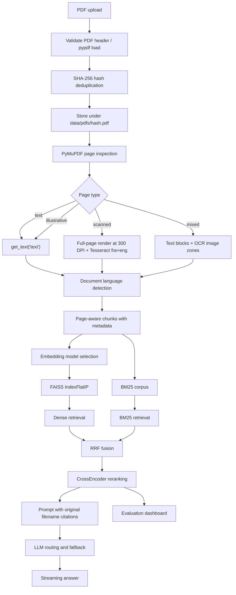
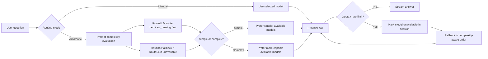

# VIKA - Evaluated RAG Assistant for Scientific Documents

## Live Demo
[](https://huggingface.co/spaces/your-username/vika)

---

# Part 1 - Concept and Presentation

## What is VIKA?
VIKA is an AI assistant that answers questions from scientific PDF documents uploaded by the user. It is designed for students, teachers, researchers, and technical teams who need answers grounded in their own course notes, articles, reports, or lecture slides.

Instead of answering only from general model knowledge, VIKA first searches the uploaded documents, extracts the most relevant passages, and asks an LLM to answer using those passages. Answers include page-level citations using the original file name, for example `[lecture_sat.pdf p.42]`.

## Who is it for?
- Students who want explanations from their lecture notes.
- Teachers who want a document-grounded assistant for course material.
- Researchers who want to query papers or reports without manually searching through pages.
- Developers and ML practitioners who want a compact RAG system that can run on Hugging Face Spaces free tier.

## What problem does it solve?
Large PDFs are hard to search and summarize manually. Generic chatbots may answer confidently but without grounding in the user's documents. VIKA reduces that risk by combining document retrieval, citation-aware prompting, model routing, and an in-session evaluation dashboard.

## User Experience
1. Upload one or more PDFs.
2. VIKA extracts text, classifies pages, chunks content, and builds search indexes.
3. Ask a question in the Gradio chat.
4. Choose either automatic LLM routing or a manual model.
5. Read the answer with page citations and the final model used.
6. Inspect retrieved chunks and session metrics in the UI.

## Main Capabilities
- Runtime PDF upload only; no preloaded demo documents.
- PDF deduplication using SHA-256.
- Smart page classification: `text`, `illustrative`, `mixed`, `scanned`.
- Targeted bilingual OCR with Tesseract `fra+eng`.
- Language detection and embedding model routing.
- Page-aware chunking with section title extraction.
- Hybrid retrieval with dense FAISS + BM25 + Reciprocal Rank Fusion.
- CrossEncoder reranking.
- Citations using original file names, truncated when too long.
- Configurable retrieval mode: `dense`, `bm25`, `hybrid`.
- Automatic or manual LLM routing.
- OpenRouter support for `openai/gpt-oss-120b`.
- Quota-aware fallback when a model is temporarily unavailable.
- Session evaluation dashboard with retrieval, latency, routing, and model metrics.

## Conceptual Architecture


## Why Automatic LLM Routing?
Not every question needs the most powerful model. A simple definition can often be answered by a smaller, faster model, while a proof, comparison, or multi-step reasoning task may need a more capable model.

VIKA supports:
- **Automatic mode**: evaluates prompt complexity and chooses a suitable available model.
- **Manual mode**: uses the model selected by the user.

The final response always shows the model actually used, including after fallback.

## Evaluation Dashboard
VIKA keeps an in-memory evaluation log for the current session. It helps users understand what happened for each question:
- Which LLM was used.
- Which retrieval mode was used.
- How many chunks were retrieved and injected.
- How long retrieval and generation took.
- Whether top retrieved chunks looked relevant according to the reranker.
- How much BM25 contributed to the final context.

## Limitations
- Hugging Face Spaces free tier has CPU-only execution and ephemeral storage.
- Uploaded documents and in-session metrics are reset when the Space restarts.
- OCR quality depends on PDF scan quality and installed Tesseract language packs.
- Complex multi-column layouts may still produce imperfect reading order.
- Hit@5, Recall@5, and MRR are proxy metrics based on CrossEncoder scores, not human labels.
- RouteLLM routers may need local weights or configuration; VIKA falls back to a local heuristic if a router is unavailable.

---

# Part 2 - Technical Implementation

## Runtime Constraints
VIKA is built for Hugging Face Spaces free tier:
- CPU only.
- Ephemeral filesystem.
- No persistent vector database.
- Gradio is the only interface.
- No FastAPI layer.
- User documents are uploaded at runtime.

## Repository Structure
| File | Purpose |
|---|---|
| `app.py` | Gradio UI, upload flow, chat flow, evaluation dashboard |
| `document_intake.py` | PDF validation, SHA-256 deduplication, manifest writing |
| `parser_utils.py` | PyMuPDF extraction, page-specific OCR, language detection |
| `page_classifier.py` | Page classification logic |
| `chunker.py` | Page-aware chunk generation |
| `embed_faiss.py` | Embedding model routing and FAISS indexing |
| `retriever.py` | Dense retrieval, BM25 retrieval, RRF fusion, retrieval metrics support |
| `reranker.py` | CrossEncoder reranking |
| `prompt_builder.py` | Prompt construction and citation label formatting |
| `llm_router.py` | Provider routing, RouteLLM/heuristic routing, fallback handling |
| `tests/` | Pytest coverage with synthetic PDFs and mocks |

## Detailed Pipeline


## Chunk Metadata
Every chunk contains:
```json
{
  "id": 0,
  "text": "chunk text",
  "doc_id": "sha256_document_id",
  "page": 42,
  "char_start": 0,
  "char_end": 1000,
  "section_title": "optional section title",
  "page_type": "text",
  "lang": "en"
}
```

The `page` field is preserved through FAISS metadata, retrieval, prompt construction, and UI citations.

## Page Classification
The page classifier uses PyMuPDF before extraction:
- `text_density = len(page.get_text("text").strip()) / page.rect.area`
- `has_images = len(page.get_images(full=True)) > 0`

Rules:
| Condition | Page type | Extraction strategy |
|---|---|---|
| text density >= 0.01 and no images | `text` | PyMuPDF text only |
| text density >= 0.01 and has images | `illustrative` | PyMuPDF text only |
| text density < 0.001 and has images | `scanned` | full-page OCR |
| 0.001 <= text density < 0.01 and has images | `mixed` | text blocks + OCR image regions |
| text density < 0.001 and no images | `text` | treated as blank or near-blank text page |

## OCR
OCR uses Tesseract through `pytesseract`:
```python
pytesseract.image_to_string(image, lang="fra+eng")
```

System packages:
```txt
tesseract-ocr
tesseract-ocr-eng
tesseract-ocr-fra
```

## Language and Embedding Routing
After extraction, `langdetect` detects the document language:
- English: `all-MiniLM-L6-v2`
- French or any non-English language: `paraphrase-multilingual-MiniLM-L12-v2`

Both embedding models are loaded at startup and reused.

## Retrieval
VIKA supports three retrieval modes:
- `dense`: FAISS semantic search only.
- `bm25`: lexical BM25 search only.
- `hybrid`: dense + BM25 fused with Reciprocal Rank Fusion.

RRF score:
```text
score = 1 / (60 + dense_rank) + 1 / (60 + bm25_rank)
```

After retrieval, the CrossEncoder reranker sorts candidates by semantic relevance before prompt injection.

## Citations
The prompt and UI use original file names from `data/manifest.csv` instead of raw SHA-256 document IDs.

Example:
```text
[lecture_sat_complexity.pdf p.42]
```

Long filenames are truncated while preserving the extension:
```text
[this_is_a_very_long_scientific_docum....pdf p.42]
```

## LLM Routing Architecture


## Supported LLM Providers
| Provider | Models in UI | Notes |
|---|---|---|
| Gemini | Gemini 2.5 Flash, Flash-Lite, Pro | Google GenAI SDK |
| Mistral | Mistral Nemo, Ministral 3 8B, Mistral Small 4 | Mistral SDK |
| Groq | Llama 3.3 70B, Llama 3.1 8B | Groq SDK |
| OpenRouter | OpenRouter GPT-OSS 120B | OpenAI `gpt-oss-120b` through OpenRouter chat completions |

## Model-Specific Prompt Wrapping
`llm_router.py` adds provider chat messages based on model style:
- `compact`: concise answer style for smaller/faster models.
- `balanced`: normal grounded RAG behavior.
- `reasoning`: asks reasoning models to keep reasoning private and return only the final cited answer.

The core RAG prompt still comes from `prompt_builder.py`.

## Quota and Fallback Handling
When a model fails with a quota, credit, rate-limit, or temporary availability error:
1. VIKA marks that model unavailable for the current session.
2. It tells the user the model cannot be used right now.
3. It lists available alternatives.
4. It falls back according to prompt complexity:
   - simple prompt: simplest available to most capable
   - complex prompt: most capable available to simplest

The final answer includes:
```text
Model used: <actual model name>
```

## Evaluation Metrics
Each query stores a session record:
```json
{
  "query_index": 1,
  "query": "What is SAT?",
  "llm_model": "Llama 3.1 8B",
  "llm_routing_mode": "Automatic",
  "retrieval_latency_ms": 120.5,
  "generation_latency_ms": 900.2,
  "total_latency_ms": 1020.7,
  "chunks_retrieved": 20,
  "chunks_used": 5,
  "reranker_score_mean": 1.23,
  "reranker_score_min": 0.51,
  "cosine_sim_mean": 0.42,
  "bm25_contribution_pct": 60.0,
  "hit_at_5": 1.0,
  "recall_at_5": 0.8,
  "mrr": 1.0,
  "page_types_used": {"text": 5},
  "retrieval_mode": "hybrid"
}
```

Metric descriptions:
| Metric | Meaning |
|---|---|
| Retrieval latency | Time spent in retrieval, fusion, and reranking |
| Generation latency | Time spent streaming from the LLM provider |
| Total latency | End-to-end query time |
| p50 latency | Median total latency for the session |
| p95 latency | 95th percentile total latency for the session |
| Chunks retrieved | Candidate chunks before final prompt selection |
| Chunks used | Chunks inserted into the prompt |
| Reranker mean / min | CrossEncoder score summary for used chunks |
| Cosine similarity mean | Mean dense similarity between query and used chunks |
| BM25 contribution % | Share of used chunks that came from BM25 candidates |
| Hit@5 | 1 if at least one CrossEncoder-relevant chunk is in top 5 |
| Recall@5 | Share of CrossEncoder-relevant retrieved chunks appearing in top 5 |
| MRR | Reciprocal rank of the first CrossEncoder-relevant chunk in top 5 |

Because the app does not have human relevance labels at runtime, `Hit@5`, `Recall@5`, and `MRR` are proxy metrics based on CrossEncoder relevance (`reranker_score >= 0`).

## Environment Variables
| Variable | Purpose |
|---|---|
| `GEMINI_API_KEY` | Google Gemini API key |
| `MISTRAL_API_KEY` | Mistral API key |
| `GROQ_API_KEY` | Groq API key |
| `OPENROUTER_API_KEY` | OpenRouter API key |
| `OPENROUTER_HTTP_REFERER` | Optional OpenRouter attribution URL |
| `OPENROUTER_APP_TITLE` | Optional OpenRouter app title |
| `VIKA_ROUTELLM_ROUTER` | Default automatic routing evaluator: `bert`, `sw_ranking`, `mf`, or `heuristic` |
| `VIKA_ROUTELLM_THRESHOLD` | Complexity threshold for simple vs complex routing |
| `VIKA_EMBED_MODEL_EN` | English embedding model |
| `VIKA_EMBED_MODEL_MULTI` | Multilingual embedding model |
| `VIKA_EMBED_BATCH_SIZE` | Embedding batch size |

## Tech Stack
| Component | Choice |
|---|---|
| UI | Gradio |
| PDF parsing | PyMuPDF |
| OCR | Tesseract + pytesseract |
| Language detection | langdetect |
| Embeddings | sentence-transformers |
| Vector index | FAISS IndexFlatIP |
| Lexical retrieval | rank_bm25 |
| Reranking | CrossEncoder `cross-encoder/ms-marco-MiniLM-L-6-v2` |
| LLM routing | RouteLLM + heuristic fallback |
| LLM providers | Gemini, Mistral, Groq, OpenRouter |
| Testing | pytest |

## Testing
Run:
```bash
pytest -q
```

The tests use synthetic PDFs and lightweight mocks. They do not require real API keys or live LLM calls.

## Roadmap
- Persistent vector store such as Qdrant Cloud.
- Human feedback logging.
- LLM-as-judge faithfulness and answer relevance metrics.
- Query rewriting or HyDE.
- Better layout reconstruction for complex multi-column PDFs.
