# VIKA - Evaluated RAG Assistant for Scientific Documents

## Live Demo

## What is VIKA?
VIKA is a retrieval-augmented assistant for students, researchers, and teachers who need grounded answers from uploaded scientific PDFs. Users upload their own documents at runtime, VIKA indexes them in-session, retrieves relevant page-aware context, and streams cited answers through a Gradio interface.

## Architecture Diagram

```mermaid
flowchart LR
    A["User uploads PDF"] --> B["Page classification<br/>text / illustrative / mixed / scanned"]
    B --> C["Text extraction + targeted OCR<br/>PyMuPDF + Tesseract fra+eng"]
    C --> D["Language detection"]
    D --> E["Page-aware chunking"]
    E --> F["Embedding model selection<br/>MiniLM EN or multilingual"]
    F --> G["FAISS dense index"]
    E --> H["BM25 lexical index"]
    G --> I["Hybrid retrieval with RRF"]
    H --> I
    I --> J["CrossEncoder reranking"]
    J --> K["Prompt construction<br/>page citations"]
    K --> L["LLM routing<br/>Gemini / Mistral / Groq"]
    L --> M["Streaming response in Gradio UI"]
    J --> N["Session evaluation dashboard"]
```

## Features
- PDF ingestion with deduplication and smart OCR
- Automatic page classification: text / illustrative / mixed / scanned
- Targeted OCR only where needed (PyMuPDF + Tesseract fra+eng)
- Automatic language detection (EN/FR/mixed) with model routing
- Page-aware chunking with section title extraction
- Hybrid retrieval: BM25 + dense FAISS with RRF fusion
- CrossEncoder reranking
- Page-level citations [doc_id p.N]
- Multi-provider LLM routing (Gemini, Mistral, Groq) with fallback
- Retrieval debug panel in UI
- In-session evaluation dashboard (latency, reranker scores, cosine similarity, BM25 contribution, page type breakdown)
- Configurable retrieval mode: dense / bm25 / hybrid

## Tech Stack
| Component | Choice | Reason |
|---|---|---|
| PDF parsing | PyMuPDF | fast, reliable text + image detection |
| OCR | Tesseract fra+eng | bilingual, free, CPU-friendly |
| Language detection | langdetect | lightweight, no API needed |
| Embeddings (EN) | all-MiniLM-L6-v2 | fast on CPU, strong English performance |
| Embeddings (FR/mixed) | paraphrase-multilingual-MiniLM-L12-v2 | strong multilingual performance |
| Vector index | FAISS IndexFlatIP | exact search, simple, no server |
| Lexical search | BM25 (rank_bm25) | handles rare terms and acronyms |
| Reranker | CrossEncoder ms-marco-MiniLM-L-6-v2 | strong precision boost |
| LLM routing | Gemini Flash / Mistral / Groq | multi-provider resilience |
| UI | Gradio | fast prototyping, HF Spaces native |

## Evaluation Dashboard
The Session Evaluation tab records one in-memory metrics row after every query. It reports retrieval, generation, and total latency; candidate and prompt chunk counts; reranker score summaries; cosine similarity against retrieved vectors; BM25 contribution; retrieval mode; and the page-type distribution used in the prompt. These metrics make it easier to see whether latency, lexical matching, dense retrieval, or page extraction quality is driving answer behavior.

## Limitations
- Ephemeral storage: uploaded documents are lost on Space restart
- Evaluation metrics are in-memory only, reset on restart
- No user authentication
- Complex multi-column PDF layouts may degrade chunking quality

## Roadmap
- Persistent vector store (e.g. Qdrant cloud free tier)
- LLM-as-judge metrics (faithfulness, answer relevancy)
- Query rewriting / HyDE
- User feedback logging
